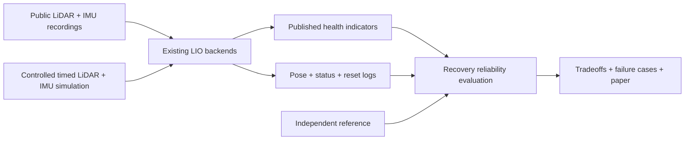
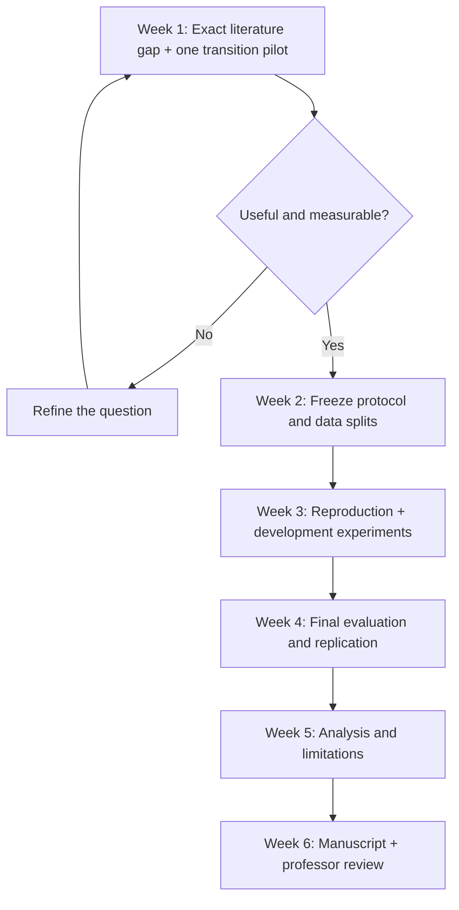

# LiDAR Localization Reliability for GNSS-Denied Navigation

A research project about **reliable localization after geometric degeneracy**, using public LiDAR/IMU recordings and controlled simulation. No physical hardware is required. The research contribution determines the scope.

> **Candidate question:** After weak geometric constraints end, how reliably do LiDAR health indicators identify the return of accurate local motion estimation?

[Research goal and weekly milestones](research_paper/RESEARCH_GOAL.md) · [Existing work and scope decision](research_paper/SCOPE_DECISION.md)

## Current status

| Item | Status |
| --- | --- |
| Modality | LiDAR + IMU; camera proposal superseded |
| Research direction | Transition-focused recovery reliability study |
| Prior-work check | Targeted check complete; exact novelty not yet established |
| Primary literature | X-ICP, SuperLoc, AdaLIO, GEODE |
| Candidate backends | FAST-LIO2 and Point-LIO; not locally reproduced |
| Data and simulation | Candidate sources identified; reference/transition eligibility pending |
| Protocol and experiments | Not implemented or frozen |
| Manuscript | Proposal abstract only; no findings |
| Deadline | First week of November, with weekly professor reviews |
| Venue | Unselected; depends on evidence |

## What the question means

In a long, repetitive corridor, LiDAR may poorly constrain motion along the corridor. After the robot exits, new geometry may make current scan matching informative again. That does not necessarily correct old drift.

We will distinguish geometric localizability, accurate local motion, and accumulated pose error. The distinction itself is established reasoning; the candidate contribution is a rigorous comparison of indicator reliability during recovery, including false reassurances, delay and transfer to unseen scenes.

## Evidence flow



Cameras, radar and GNSS are not estimator inputs. A reference system may supply evaluator truth if its accuracy and independence are documented. Recorded motion is fixed: replay is not adaptive-flight validation.

## Scope

One failure mechanism: geometric degeneracy and the transition out of it. One primary LIO backend plus a replication backend; compare a conventional indicator with a relevant published localizability/risk measure. One controlled geometry family plus eligible public recordings.

No new full navigation stack, hardware purchase, physical flight, embedded deployment, camera system or landing controller. Public aerial data are preferred for UAV claims; ground-platform evidence must be labeled accurately.

## Weekly plan



The [goal](research_paper/RESEARCH_GOAL.md) gives dates from September 21 to November 1, with early-November revision time subject to the exact deadline.

## What we will measure

- False reassurance versus recovery-detection delay and indicator availability.
- Sustained local relative-error recovery, independently labeled.
- Accumulated original-frame drift, reported separately.
- Missing output, resets, crashes, non-recovery and backend repeatability.
- Transfer across held-out trajectories/scenes, with uncertainty by independent trajectory/event.

Do not call a local geometric indicator wrong merely because it does not correct historical global drift. Do not hide resets through post-event realignment. Thresholds, windows, scene splits and repetition counts are frozen after development pilots.

Planned figures: geometry-transition schematic, indicator/error/drift timeline, false-reassurance versus delay plot, and held-out comparisons with uncertainty.

## Novelty and publication gate

Generic LiDAR degeneracy detection and robust fusion already exist. X-ICP, SuperLoc, AdaLIO and GEODE must be compared before making a contribution claim. [The scope decision](research_paper/SCOPE_DECISION.md) records what is known and what still needs verification.

Aim for a focused empirical paper. A predictable drift demonstration is insufficient. Strong-venue suitability requires a useful new finding and convincing validation; no acceptance guarantee is implied. A workshop paper may be non-archival and is not equivalent to an ICRA/IROS main-track paper.

## Files and maintenance

```text
research_paper/RESEARCH_GOAL.md       Current LiDAR goal and evaluation direction
research_paper/SCOPE_DECISION.md      Prior work and publication assessment
research_paper/PLAN_REVIEW.md         Historical broad-proposal review
research_paper/paper/main.tex         Proposal abstract
research_paper/paper/README.md        Build instructions
output/pdf/main.pdf                  Compiled abstract
old_data/                            Archived safe-landing prototype
```

[LaTeX/build instructions](research_paper/paper/README.md) · [Abstract PDF](output/pdf/main.pdf) · [Archived prototype](old_data/README.md)

Update status and link evidence at each professor-review milestone. Record rejected ideas, protocol changes and failures. Rewrite the abstract around findings when they exist.

User resources: 16 GB RAM/RTX 4060 laptop; this supports the work but does not define its scientific value. Old synthetic landing results are separate evidence. Run archived commands inside old_data, preserve its held-out seeds and boundaries, and keep this project independent of VERGE-CUAS.
