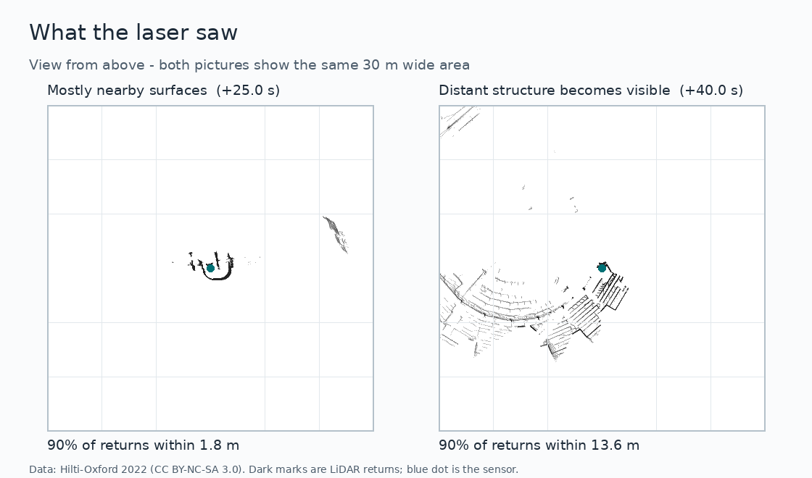
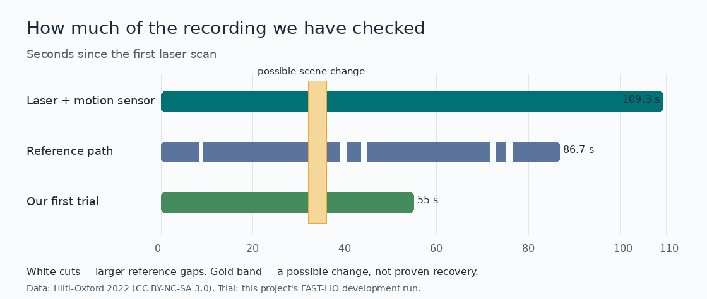

# Can a robot tell when it knows where it is again?

This is a research project about navigation when GPS is not available. We want to learn whether a robot can tell when its movement estimate has become reliable again after passing through a confusing place. The idea could help future GPS-denied drones, but **we have not tested a flying drone**.

**Authors:** Harshil Patel, Daksha Lingampeta, Nisarg Vyas

**Status (24 September 2026):** We have a working comparison program and one limited real-data trial. We have **not** proved recovery or flight safety.

## The problem, in simple words

Imagine walking through a long passage where every wall looks alike. It is hard to tell how far you have walked. When you reach a larger room with corners and objects, there are more clues. But seeing more clues does not magically erase a wrong guess you made in the passage.

A robot has a similar problem. It can use **LiDAR** (a laser distance sensor) and an **IMU** (a movement-and-turning sensor) to guess how it moved. We want to test the program's **health signal**: does it say “my movement estimate is good again” at the right time, or does it become confident too early?

We will keep two questions separate:

1. Is the robot measuring its **new movement** correctly now?
2. Is its **total position** still wrong because of earlier mistakes?

That difference is the heart of this research. We are testing existing warning signals, not building a new drone or a new complete navigation system.

## Pictures from the new recording

These are real LiDAR measurements from the **Hilti-Oxford Exp18** recording. The blue dot is the sensor. Dark marks show where the laser measured surfaces. Both pictures use the **same scale**, so the wider pattern on the right is not just a zoom effect.

The sensor clearly moves from mostly nearby surfaces to seeing more distant and varied structure. We checked that change using laser measurements alone and marked a 31.6–33.6 second **scene exit** before looking at position errors. It does **not** mark the moment the position estimate recovered.

The next picture shows how much data we have. The laser and IMU recording lasts about 109 seconds. The published “answer key” path stops after about 87 seconds and has gaps. Our first trial used only the first 55 seconds. The gold band marks the scene change, **not** a measured recovery time.

The pictures are made from the downloaded recording; their [source, method and limits](research_paper/figures/README.md) are documented. Data credit: [Hilti-Oxford Dataset](https://hilti-challenge.com/dataset-2022), used under [CC BY-NC-SA 3.0](https://creativecommons.org/licenses/by-nc-sa/3.0/).

## What we have actually done

We ran an existing LiDAR-and-IMU navigation program, **FAST-LIO**, on the first 55 seconds of the new recording. It read 551 laser scans and produced 546 estimated positions without crashing. We then did one basic check: how far did it say the sensor moved over each time span?

| Time span in the recording | Program's movement | Published reference's movement |
| --- | ---: | ---: |
| 10–30 seconds | 7.82 m | 7.85 m |
| 30–50 seconds | 12.02 m | 11.94 m |
| 35–54 seconds | 9.47 m | 9.46 m |

The distances are close, but two paths can have almost the same length while taking different turns or ending in different places. We therefore built a more careful comparison that checks both movement **and turning** over 1-second and 3-second periods. The full experiment suite now passes **28 small tests**. On this real trial, the published answer path is missing for much of the important period after the scene exit: only **13 of 56** planned 1-second checks and **none of 56** planned 3-second checks there could be scored. The remaining errors cannot prove lasting recovery. See the [trial report](research_paper/evidence/HILTI_EXP18_T07_PILOT.md) for the counts and limitations.

Before this, we tried another public recording called GEODE. Its runs finished, but the movement estimates were clearly poor, and the reference path did not clearly identify the sensor frame needed for a fair comparison. We have kept those failures visible. Passing code tests is not the same as proving the research idea.

## What still needs to happen

- Measure a real health signal from the navigation program and check that it reacts to weak and stronger laser geometry. The current separate geometry check is **not** the program's own health signal.
- Find a recording with an answer path that covers the important period and measures both position and turning independently. Treat missing reference sections as **unknown**, never as “zero error.” This Hilti answer path was made partly using LiDAR data, so it is not independent.
- Compare the health signal with actual movement errors on enough separate scene changes. If suitable real data do not exist, clearly narrow the paper to a controlled-simulation study instead of pretending that this trial answered the original question.
- Repeat the study on separate scenes and in controlled simulation before making a general conclusion.

No cameras were used by the navigation program. This new recording was collected with a **handheld sensor**, not a drone. Neither these data nor simulation can prove flight safety. The older, separate safe-landing prototype is kept in [`old_data/`](old_data/README.md).

## Read more

- [Research goal](research_paper/RESEARCH_GOAL.md) — the precise scientific question.
- [Current status](research_paper/execution/STATUS.md) — what is done and what remains.
- [Start here for future work](research_paper/execution/CURRENT_HANDOFF.md) — the exact next checks and where the data live.
- [New recording inspection](research_paper/data/HILTI_EXP18_INSPECTION.md) and [first trial](research_paper/data/HILTI_EXP18_REPLAY.md) — evidence behind this page.
- [Scene event](research_paper/data/HILTI_EXP18_EVENT.md), [error audit](research_paper/evidence/HILTI_EXP18_T07_PILOT.md), and [alternative-data screen](research_paper/data/ALTERNATIVE_REFERENCE_AUDIT.md) — why this is not yet a recovery result.
- [Execution plan](research_paper/AGENT_EXECUTION_PLAN.md) — the next research steps and review gates.
- [Proposal manuscript](research_paper/paper/README.md) — not a results paper yet.
