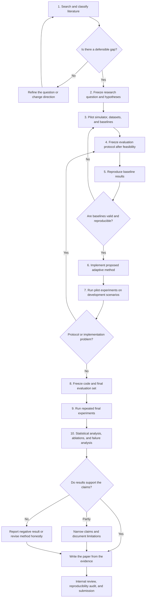
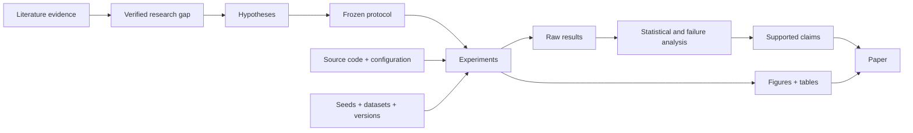
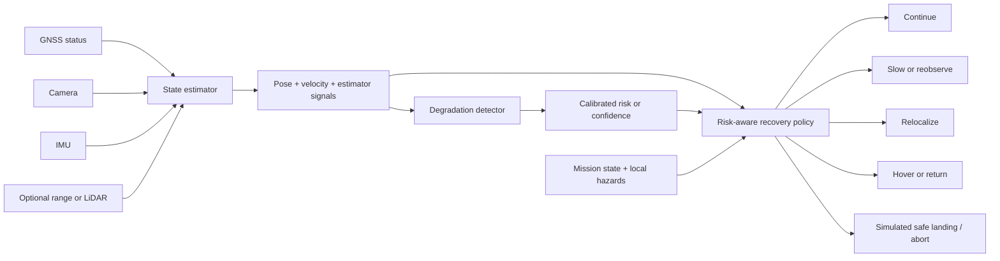

# Resilient GNSS-Denied Drone Navigation

This repository is being rebuilt as a **step-by-step research-paper project** about failure-aware navigation for drones operating without reliable GNSS.

The immediate objective is not to write a paper quickly or to force the previous prototype into a new publication. It is to construct a defensible research question, verify the gap in existing literature, freeze an evaluation protocol, gather reproducible evidence, and then write only the claims supported by that evidence.

> **Working research question**
> Can an uncertainty-aware adaptive navigation system improve mission success and safety after GNSS loss by detecting localization degradation and dynamically selecting an appropriate recovery action?

The full initial direction is recorded in [research_paper/RESEARCH_GOAL.md](research_paper/RESEARCH_GOAL.md).

## Current status

| Item | Status |
| --- | --- |
| Broad topic selected | Complete |
| Initial 4W + 1H defined | Complete |
| Working research question written | Complete |
| Previous prototype separated from new research | Complete |
| Structured literature review | Not started |
| Verified research gap | Not started |
| Simulator and datasets selected | Not started |
| Baselines selected and reproduced | Not started |
| Proposed method implemented | Not started |
| Experiments and statistical analysis | Not started |
| Paper draft | LaTeX template and provisional abstract compiled; experiments pending |
| Target venue | Not selected |

**Active phase:** Phase 1 — structured literature and feasibility review.

**Plan review (20 September 2026):** The roadmap is sound but too broad to execute as a first paper. [The review](research_paper/PLAN_REVIEW.md) records novelty overlap, action-feasibility concerns, calibration/data-split requirements, stronger baselines, and a recommended minimum study. The narrower scope remains provisional until literature and a platform pilot confirm it.

**Manuscript:** [LaTeX source and build instructions](research_paper/paper/README.md) · [Compiled abstract PDF](output/pdf/main.pdf). The abstract describes proposed work and contains no experimental findings.

## Research direction: 4W + 1H

| Question | Current answer |
| --- | --- |
| **What?** | Resilient autonomous navigation after GNSS loss, including localization-degradation detection and safe recovery. |
| **Why?** | A navigation system can become unreliable under visual, inertial, environmental, or sensor degradation while remaining dangerously confident. |
| **Who?** | Researchers and developers working on autonomous micro aerial vehicles and reproducible GNSS-denied navigation. |
| **Where?** | Controlled simulated indoor, urban-canyon, tunnel, and degraded-perception environments; public real-world datasets where appropriate. |
| **How?** | A confidence-calibrated degradation detector, a risk-aware recovery policy, and a reproducible evaluation against non-adaptive baselines. |

## North-star contribution

The proposed contribution is a:

> **Confidence-calibrated localization-degradation detector and risk-aware recovery policy for GNSS-denied UAV navigation, evaluated under controlled sensor and environmental failures.**

This is provisional. It becomes the paper's final contribution only if the literature review confirms that it fills a real gap and the planned experiments are feasible.

The intended innovation is the connection between:

1. estimated localization uncertainty;
2. actual localization error;
3. early detection of degradation;
4. adaptive recovery decisions; and
5. end-to-end mission safety and success.

## Visual research roadmap



## Evidence pipeline

The project will keep assumptions, implementation, results, and claims traceable.



Every important paper claim should point backward to a figure, table, analysis file, raw result, configuration, and reproducible command.

## Step-by-step plan

Each phase ends with a decision gate. We will update this README whenever a gate is passed or the research direction changes.

### Phase 1 — Structured literature and feasibility review

**Purpose:** Learn what has already been solved and prevent an unsupported novelty claim.

**Work:**

- define search questions, databases, keywords, inclusion dates, and exclusion rules;
- collect recent surveys plus primary papers on VIO, visual–inertial–LiDAR fusion, uncertainty estimation, failure detection, recovery policies, and GNSS-denied benchmarks;
- record each paper's sensors, environment, simulator or dataset, baseline, metrics, limitations, released code, and claimed contribution;
- distinguish localization, navigation, planning, and safe recovery instead of treating them as the same task;
- identify gaps that are important, testable without hardware, and narrow enough for rigorous evaluation; and
- investigate suitable publication venues only after the likely contribution is clear.

**Artifacts:** literature-search protocol, paper matrix, annotated bibliography, gap map, and feasibility comparison.

**Exit gate:** At least one important gap is supported by the reviewed literature and can be tested using available simulation or public data.

### Phase 2 — Freeze the research question and hypotheses

**Purpose:** Convert a broad idea into falsifiable claims.

**Candidate hypotheses:**

- **H1:** The proposed detector identifies localization degradation earlier or more accurately than fixed-threshold and estimator-native confidence baselines.
- **H2:** Adaptive recovery reduces collisions or unsafe continuation compared with always-continue navigation.
- **H3:** The method improves mission success compared with an always-abort policy while maintaining a predefined safety constraint.
- **H4:** Benefits persist across unseen environments, random seeds, and degradation types rather than only the development scenarios.

These are placeholders. Literature evidence and feasibility results will determine their final wording.

**Artifacts:** final problem statement, hypotheses, contribution statement, scope, assumptions, and terminology.

**Exit gate:** Every hypothesis has independent variables, dependent variables, baselines, success criteria, and a feasible test.

### Phase 3 — Design and freeze the evaluation protocol

**Purpose:** Decide how evidence will be collected before looking at final results.

**Decisions to freeze:**

- vehicle model and mission tasks;
- sensor suite and estimator interfaces;
- simulator and version;
- public datasets and permitted uses;
- environments and withheld evaluation scenes;
- degradation models and severity levels;
- development seeds versus untouched final-evaluation seeds;
- baselines, ablations, metrics, number of runs, and statistical tests;
- compute budget and reproducibility requirements; and
- rules for failed, timed-out, or invalid runs.

**Artifacts:** experiment protocol, scenario catalogue, metric definitions, seed policy, analysis plan, and threat-to-validity checklist.

**Exit gate:** Another researcher could understand exactly how the proposed claims will be tested without seeing the final results.

### Phase 4 — Build the reproducible experiment platform

**Purpose:** Produce reliable infrastructure before implementing the proposed method.

**Work:**

- install and pin the chosen simulator and dependencies;
- create deterministic scenario configurations;
- separate ground truth from observations available to the method;
- add structured logging for pose, uncertainty, events, decisions, collisions, recovery actions, runtime, and resource usage;
- save code revision, configuration, random seed, environment, dependency versions, and warnings for every run; and
- create automated smoke tests and a small end-to-end pilot.

**Artifacts:** setup guide, environment lock, scenario definitions, run manifest, logging schema, and reproducibility command.

**Exit gate:** A clean setup can reproduce the same pilot result within defined tolerances.

### Phase 5 — Reproduce strong baselines

**Purpose:** Establish credible comparisons before claiming improvement.

Possible baseline families include:

- dead reckoning or inertial-only continuation;
- visual-inertial odometry or SLAM;
- a fixed sensor-fusion estimator;
- estimator-native confidence with a fixed threshold;
- always continue, always hover, and always abort recovery policies; and
- an oracle using simulator ground truth, used only as an upper bound—not as an operational method.

Final baselines will be selected from the literature and must fit the exact task.

**Artifacts:** baseline implementations or integrations, reproduction report, parameter records, and baseline result tables.

**Exit gate:** Baselines behave as expected and any mismatch with published results is understood and disclosed.

### Phase 6 — Implement the proposed method

The tentative system structure is:



Ground truth will be available to evaluation code but never to the degradation detector or recovery policy.

**Artifacts:** method specification, implementation, unit tests, model or rule configuration, and computational-cost report.

**Exit gate:** The method passes unit, interface, leakage, determinism, and pilot-scenario checks.

### Phase 7 — Pilot experiments and ablations

**Purpose:** Find implementation and protocol problems using development scenarios only.

Candidate ablations may remove uncertainty calibration, individual detector features, temporal history, adaptive actions, or individual sensing modalities. Changes motivated by pilot results must be logged. Final-evaluation scenarios remain untouched.

**Exit gate:** Code, metrics, analysis scripts, method configuration, and final hypotheses are frozen.

### Phase 8 — Final evaluation

The final experiment should vary multiple factors rather than report one demonstration flight.

| Experimental factor | Candidate levels; not yet frozen |
| --- | --- |
| Environment | indoor, urban canyon, tunnel, degraded visibility |
| GNSS event | sudden loss, intermittent loss, gradual degradation, possible spoof-like inconsistency if justified |
| Perception degradation | texture loss, blur, illumination change, dropout, outliers |
| Motion stress | speed, rotation, aggressive manoeuvre, vibration or timing effects |
| Severity | mild, moderate, severe |
| Policy | proposed adaptive, fixed threshold, always continue, always abort |
| Randomization | multiple untouched seeds and unseen scenes |

All conditions need not be included. The final matrix must be large enough to test generality but small enough to run, inspect, and reproduce properly.

**Exit gate:** All planned runs are accounted for, including failures, with no post-hoc removal of inconvenient results.

### Phase 9 — Analysis and visualization

Evaluation will cover four layers:

| Layer | Candidate measurements |
| --- | --- |
| Localization | absolute/relative trajectory error, drift, orientation error |
| Detection and confidence | precision, recall, false alarms, detection delay, calibration error, false-confidence rate |
| Navigation and safety | mission success, collision rate, unsafe continuation, minimum clearance, recovery success, unnecessary aborts |
| Practicality | latency distribution, memory, compute load, failure rate |

Results should include confidence intervals, effect sizes, distribution plots, per-environment breakdowns, ablations, representative trajectories, and failure cases—not only averages.

**Exit gate:** Conclusions can be traced to analyses, and alternative explanations and limitations are documented.

### Phase 10 — Write and review the paper

The paper will be written from the validated evidence using this provisional structure:

```text
1. Abstract
2. Introduction and contributions
3. Related work
4. Problem formulation and assumptions
5. Proposed method
6. Experimental protocol
7. Results
8. Ablations and failure analysis
9. Discussion, limitations, and threats to validity
10. Conclusion
11. Reproducibility statement and supplementary material
```

An initial proposal abstract and working title are available now. The final abstract, title, and contribution list will be rewritten after the results are known.

**Exit gate:** Internal technical review, citation audit, claim-to-evidence audit, figure audit, language review, and clean-environment reproduction are complete.

## What success means

A successful outcome is not necessarily a positive result. Success means producing a rigorous and reproducible answer to the research question. The project should:

- establish a literature-supported gap;
- compare against appropriate baselines;
- avoid ground-truth leakage;
- evaluate unseen conditions and repeated trials;
- measure safety, usefulness, calibration, and computational cost;
- report failures and negative results;
- release enough configuration and code for reproduction; and
- make claims no stronger than the evidence.

Publication at a strong venue cannot be guaranteed. The controllable objective is work that can survive serious peer review.

## Research boundaries

- This is a simulation-first research project because physical UAV hardware is unavailable.
- Dataset replay can validate parts of localization or detection, but it is not closed-loop flight validation.
- Simulated success is not proof of real-world safety or deployment readiness.
- The work will use **GNSS-denied** when referring to the general problem; GPS is one GNSS.
- The project will not claim to solve all localization, mapping, planning, control, and landing problems at once.
- Safe landing may be evaluated as a recovery action without remaining the central research problem.
- No physical aircraft will be commanded by this research prototype.
- The project remains separate from VERGE-CUAS.

## Living repository layout

```text
.
├── README.md                         # this living roadmap and status page
├── research_paper/
│   ├── RESEARCH_GOAL.md              # initial agreed research direction
│   ├── PLAN_REVIEW.md                # issues and recommended narrower study
│   └── paper/                       # LaTeX source and build instructions
├── output/pdf/main.pdf              # compiled proposal abstract
├── old_data/                         # archived pre-paper safe-landing prototype
│   ├── README.md
│   ├── docs/
│   ├── notebooks/
│   ├── results/
│   ├── src/
│   ├── tests/
│   └── pyproject.toml
├── AGENTS.md                         # repository working instructions
└── .gitignore
```

As the research develops, new material should be organized approximately as follows:

```text
research_paper/
├── RESEARCH_GOAL.md
├── literature/                       # search protocol, paper matrix, notes
├── protocol/                         # frozen hypotheses and experiment plan
├── method/                           # equations, pseudocode, design decisions
├── experiments/                      # run configurations and manifests
├── analysis/                         # analysis code and derived tables
├── figures/                          # publication figures with provenance
├── paper/                            # manuscript and bibliography
└── decisions/                        # dated research decisions and changes
```

Directories will be created when their phase begins; an empty paper structure is not evidence of progress.

## Archived prototype

The previous hardware-constrained safe-landing prototype has been moved intact to [`old_data/`](old_data/). It is retained for provenance and possible reuse, but its assumptions, code, synthetic results, and documentation are **not automatically evidence for the new paper**.

Its original overview is available at [old_data/README.md](old_data/README.md).

## How this README will evolve

Whenever new evidence or a major decision is added:

1. update the current-status table and active phase;
2. link the new artifact rather than duplicating it;
3. record decisions, rejected alternatives, and reasons;
4. separate confirmed facts from hypotheses and planned work;
5. update diagrams if the method or workflow changes;
6. preserve failed experiments and limitations; and
7. date major protocol changes that could affect interpretation.

This README is the project map. Detailed evidence belongs in versioned files under `research_paper/` and should be linked here as it becomes available.

## Immediate next step

The next step is **not implementation**. It is to create and execute the structured literature-review protocol, producing:

1. research and search questions;
2. keyword groups and database queries;
3. inclusion and exclusion criteria;
4. a paper-extraction matrix;
5. a taxonomy of existing approaches;
6. a research-gap map; and
7. a shortlist of feasible simulator, dataset, baseline, and method combinations.

Only after that evidence is reviewed will the research question, hypotheses, simulator, sensors, recovery actions, and evaluation metrics be frozen.
