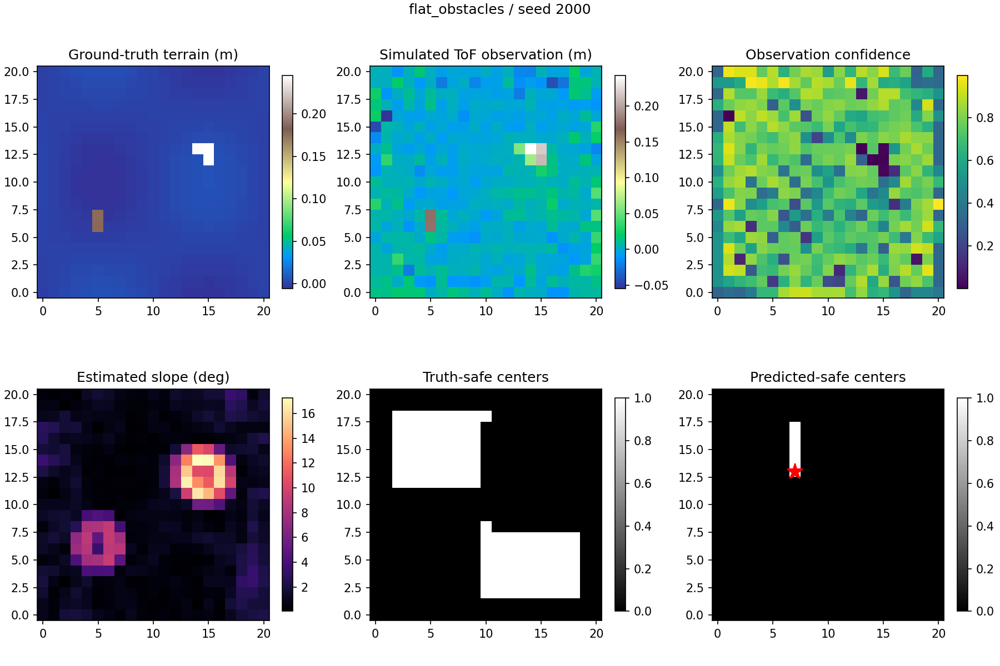

# GPS-Denied Drone Navigation and Safe Landing

This project explores a practical question:

> Can a drone use inexpensive onboard distance sensing to find a safe place to land when GPS is unavailable?

The repository contains a working, simulation-first baseline. It creates synthetic terrain, simulates the limitations of a low-cost multizone ToF/LiDAR sensor, checks the terrain for hazards, and either returns a footprint-safe landing target or explicitly reports that there is not enough evidence to land safely.

This is a three-person, third-year university design project. The goal is a measurable and reproducible prototype that can later move onto affordable drone hardware—not an immediate claim of flight-ready autonomy.

## What works today

The current Python implementation can:

- generate five repeatable terrain families;
- create independent noise-free ground truth;
- simulate an 8×8 downward-facing ToF/LiDAR sensor;
- model range noise, quantization, missing readings, outliers, pose error, and accumulated pose drift;
- estimate terrain slope, roughness, height discontinuities, and observation confidence;
- reject hazards and check the drone's complete landing footprint;
- rank safe candidate locations or return no target;
- save diagnostic arrays, plots, per-run metrics, and benchmark summaries; and
- run without a GPU, ROS 2, Gazebo, PX4, or an internet connection.

It does **not** yet control a real drone. Physical sensor validation, Raspberry Pi benchmarking, GPS-denied position-hold testing, PX4 integration, and controlled flight tests are later gates.

## How it works

```text
Synthetic terrain
      |
      +----> noise-free ground truth
      |
      v
Low-cost sensor and pose simulation
      |
      v
Bounded local elevation grid
      |
      +----> slope
      +----> roughness
      +----> step/obstacle height
      +----> confidence
      |
      v
Hazard rejection + localization margin
      |
      v
Full drone-footprint validation
      |
      v
Ranked safe target or NO_SAFE_TARGET
```

The method is intentionally geometry-first. Its decisions can be inspected and explained, and its computational cost is low enough to target inexpensive onboard computers. A learned model may be added later only if experiments show a limitation that geometry alone cannot solve.

## Example result

The figure below shows the pristine terrain, simulated noisy observation, estimated slope, ground-truth safe centers, and the smaller set of conservatively predicted safe centers. The red star is the selected target.



## Verified baseline result

The accepted v0.1 held-out suite used seeds `2000–2019`, which were not used for threshold selection. It contains 100 runs: five scenario families with 20 seeds each.

| Measure | Held-out result | Plain-language meaning |
| --- | ---: | --- |
| Predicted-safe-cell precision | 100% | Every cell labelled safe in this suite was safe in synthetic ground truth |
| False-safe-cell rate | 0% | No unsafe cell was accepted |
| Validity of selected targets | 100% | Every target that was produced had a truth-safe full footprint |
| No-safe-scene rejection | 100% | Every deliberately impossible scene returned no target |
| Target availability | 56.25% | The conservative system found a target in 45 of 80 scenes containing safe terrain |
| Mean safe-scene recall | 6.68% | It deliberately rejects most usable cells to protect against false-safe decisions |
| Desktop detector p95 | 2.86 ms | Local desktop timing only; this is not a Raspberry Pi measurement |
| Peak traced detector allocation | 341 KiB | Detector allocations only; this is not total process memory |

The important limitation is target availability. The detector is safe but overly cautious. The next algorithmic milestone is an adaptive second survey that gathers better evidence when the first pass returns no target, without relaxing the safety thresholds.

Machine-readable evidence is saved in [`results/reference/v0_1_held_out`](results/reference/v0_1_held_out). These results are synthetic and do not prove that physical flight is safe.

## Intended affordable hardware

The code is designed around a replaceable sensor adapter, so the landing algorithm does not depend on one manufacturer.

### First hardware profile

- **Terrain sensor:** VL53L5CX-class 8×8 multizone direct-ToF module.
- **Companion computer:** Raspberry Pi Zero 2 W-class Linux computer.
- **Flight controller:** a PX4- or ArduPilot-capable controller remains responsible for stabilization and failsafes.
- **GPS-denied motion estimate:** flight-controller IMU/barometer plus a PMW3901-class downward optical-flow sensor and valid downward range.

The 8×8 sensor was chosen over a single-point rangefinder because one downward ray can measure height but cannot independently prove slope, roughness, obstacle clearance, and full-footprint support.

### Upgrade profile

An LDROBOT LD19-class 2D scanning LiDAR can later produce denser downward or oblique scan slices. Pose-corrected slices will feed the same local elevation-grid interface, so the core detector does not need to be rewritten.

The final sensor purchase remains provisional until the team confirms indoor/outdoor use, drone size and payload, local availability, and budget. See the [hardware architecture decision](docs/ADR-001-HARDWARE-CONSTRAINED-PIPELINE.md) for specifications, sources, alternatives, and integration gates.

## Quick start

### Requirements

- Git
- Python 3.10 or newer
- No GPU required

### Windows PowerShell

```powershell
git clone https://github.com/Marshmellow31/gps-denied-drone-navigation.git
Set-Location gps-denied-drone-navigation
python -m venv .venv
.\.venv\Scripts\python.exe -m pip install --upgrade pip
.\.venv\Scripts\python.exe -m pip install -e ".[dev,plot]"
.\.venv\Scripts\python.exe -m pytest -q
```

### Linux, macOS, or Google Colab terminal

```bash
git clone https://github.com/Marshmellow31/gps-denied-drone-navigation.git
cd gps-denied-drone-navigation
python -m venv .venv
source .venv/bin/activate
python -m pip install --upgrade pip
python -m pip install -e ".[dev,plot]"
python -m pytest -q
```

For an interactive walkthrough, open [`notebooks/01_hardware_constrained_baseline.ipynb`](notebooks/01_hardware_constrained_baseline.ipynb). The notebook contains a Colab bootstrap cell.

## Run one simulation

```bash
python -m gps_denied_landing.cli run \
  --scenario flat_obstacles \
  --seed 2000 \
  --output results/generated/example \
  --plot
```

PowerShell accepts the same command on one line:

```powershell
python -m gps_denied_landing.cli run --scenario flat_obstacles --seed 2000 --output results/generated/example --plot
```

The output folder contains:

- `manifest.json` — configuration, selected target, and metrics;
- `layers.npz` — terrain and diagnostic arrays; and
- `diagnostic.png` — a human-readable visual summary.

## Reproduce the held-out benchmark

```bash
python -m gps_denied_landing.cli benchmark \
  --seeds 20 \
  --seed-start 2000 \
  --output results/generated/held-out
```

Do not tune thresholds using seeds `2000–2019`; they are the frozen v0.1 evaluation partition. The command writes `runs.csv` and `summary.json`.

## Available terrain scenarios

| Scenario | What it tests |
| --- | --- |
| `flat_obstacles` | Mostly level ground with raised hazards |
| `mixed_slope` | A safe region beside terrain that is too steep |
| `rough_patch` | Smooth and rough surfaces in the same scene |
| `step_and_pit` | Steps, depressions, and raised obstacles |
| `no_safe_zone` | Safe failure when no valid landing footprint exists |

## Safety philosophy

An unsafe acceptance is more serious than rejecting a usable site. The baseline therefore follows these rules:

1. Ground truth is generated before sensor corruption and never given to the detector.
2. Unknown or low-confidence terrain is not silently treated as safe.
3. The complete drone footprint, clearance margin, and localization uncertainty are checked.
4. A scene may return `NO_SAFE_TARGET`; a target is never fabricated for demonstration purposes.
5. The flight controller—not this Python package—will own stabilization, arming, manual override, link-loss response, and final failsafes.
6. Physical flight requires separate hazard analysis, restrained tests, a geofenced site, a human pilot override, and applicable regulatory approval.

LiDAR geometry also cannot determine whether water, weak roofing, deep grass, snow, or another visually flat material can support the aircraft. Material/semantic safety will require an additional sensing layer.

## Development plan

### Now: strengthen the simulation

- Add an adaptive second-survey strategy.
- Add direct sunlight, low-reflectivity, vibration, motion-distortion, and stronger pose-drift conditions.
- Improve tests for every geometry layer and failure mode.
- Add formatting, linting, type checks, and continuous integration.

### Next: prove the cheap hardware path

- Run the benchmark on a Raspberry Pi Zero 2 W and record p50/p95 latency, total RSS, temperature, and throttling.
- Bench-test the chosen ToF/LiDAR against ramps, blocks, gravel, grass, dark cloth, reflective surfaces, and sunlight.
- Record real sensor logs and replay them through the same detector.
- Validate optical-flow plus range positioning with GPS disabled.

### Later: integrate without weakening safety

- Connect the stable core to PX4 Software-in-the-Loop.
- Add stale-data, pose-quality, and companion-computer-loss failsafes.
- Test target handoff and approach planning in simulation.
- Progress through propellers-off, restrained/tethered, and controlled low-altitude tests only after each prior gate passes.

Navigation and SLAM remain extensions. A complete, defensible safe-landing detector is more valuable for this course than several incomplete robotics integrations.

## Repository map

```text
.
├── src/gps_denied_landing/   # terrain, sensor, geometry, evaluation, and CLI code
├── tests/                    # deterministic baseline tests
├── notebooks/                # Colab/local interactive walkthrough
├── results/reference/        # reviewed tuning, held-out, and example evidence
├── results/generated/        # ignored local experiment output
├── docs/                     # architecture, evaluation, roadmap, status, and decisions
├── pyproject.toml            # package and dependency definition
└── README.md
```

## Detailed documentation

- [Current verified status](docs/CURRENT_STATUS.md)
- [Hardware-constrained architecture decision](docs/ADR-001-HARDWARE-CONSTRAINED-PIPELINE.md)
- [System architecture and module contracts](docs/ARCHITECTURE.md)
- [Evaluation protocol](docs/EVALUATION.md)
- [End-to-end execution plan](docs/EXECUTION_PLAN.md)
- [Phased roadmap](docs/ROADMAP.md)
- [Development setup](docs/SETUP.md)
- [Task backlog](docs/TASKS.md)
- [Decision log](docs/DECISIONS.md)
- [Project boundaries](docs/PROJECT_CONTEXT.md)

## Project identity

This university design project is separate from VERGE-CUAS. General overlap in UAV concepts does not imply shared scope, deliverables, ownership, or competition objectives.
