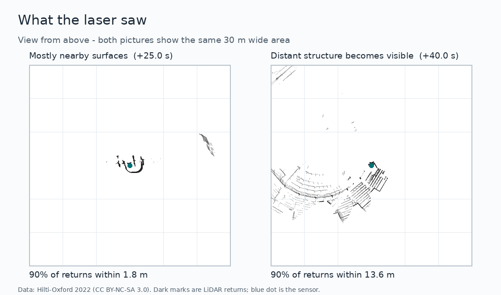
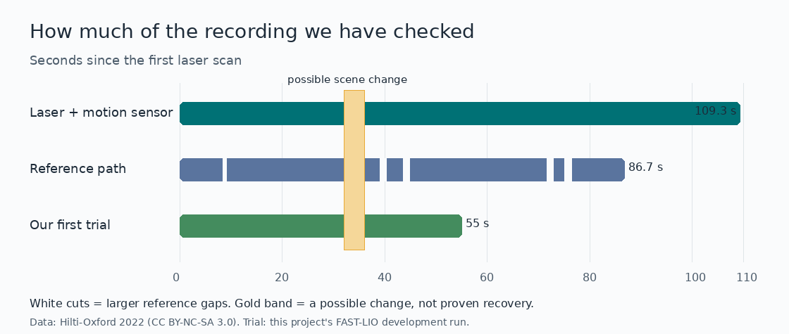
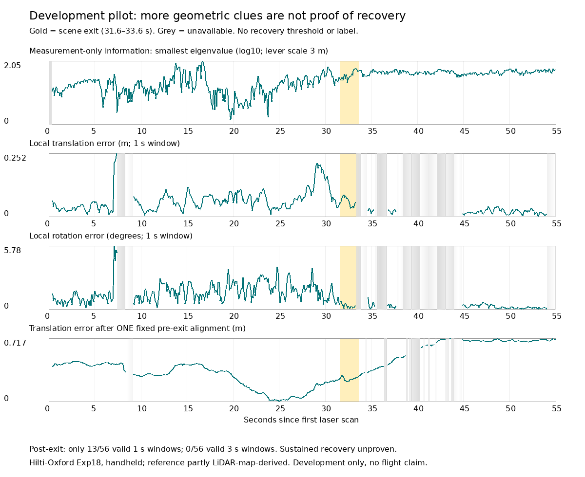
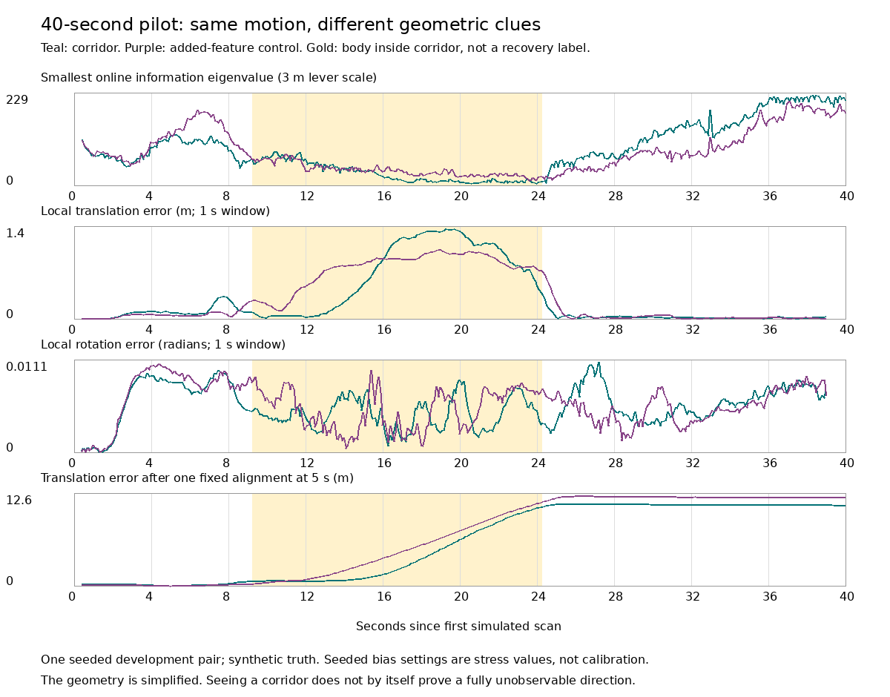
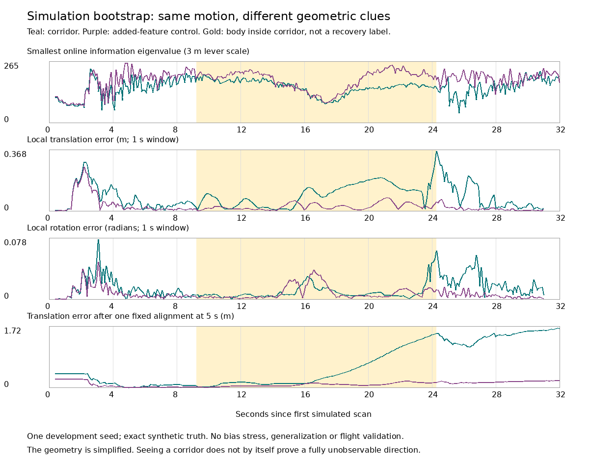

# Can a LiDAR robot tell when its movement estimate is reliable again?

This project studies one question: **after a robot leaves a place with few useful shapes, can its existing warning signals tell us when its new movement estimate is accurate again?**

The answer is not known yet. We have completed a controlled computer-simulation study on 32 practice layouts, but the independent implementation review has not passed and the untouched final layouts have not been tested. **No drone was flown, and these results do not prove flight safety.**

**Current checkpoint — 27 September 2026:** the research rules passed the protocol review (R2), but the first implementation review (R3) returned **REVISE**. Repairs are still needed. The latest test run had 91 tests: 88 passed, 2 errored because required repeat-audit files are not yet present, and 1 optional SciPy test was skipped. So the software checks are **not all green yet**.

## The idea in everyday words

Imagine walking down a long hallway where every wall looks the same. You may lose track of how far you have walked. When you reach a room with corners and objects, it becomes easier to judge each new step. But seeing the room does not undo a mistake you made earlier in the hallway.

A robot has a similar problem. **LiDAR** measures distances with laser light. An **IMU** measures movement and turning. A navigation program combines them to estimate where the robot is. We want to test whether the program's own *health warning* agrees with how accurate its next movements really are.

We keep three things separate:

1. **How many geometric clues are visible?**
2. **Is the robot's new movement estimate accurate?**
3. **Has the robot's total position already drifted away from the right place?**

More visible walls may help with the next movement without fixing old drift. That is why a warning signal must be checked against measured movement, not judged just by looking at the scene.

### The study's recovery rule

For this experiment, a run counts as recovered only after **three one-second movement checks in a row** each stay within 0.20 metres of the simulated answer and within 5 degrees of its direction. All three checks must finish within 20 seconds of leaving the corridor. These are research cutoffs—not aircraft safety limits.

### A few research words

- **Reference path:** the answer path used to check the estimated movement. In simulation it is calculated separately from the robot program.
- **Control run:** a matched simulation with the same movement but extra wall features, so we can compare a corridor with a more informative scene.
- **False healthy:** the program says “movement is reliable” while the measured movement is still outside the agreed limits.
- **Practice (development) layouts:** data used to build and check the method. **Final (held-out) layouts:** unseen data saved for the last test. We must not tune the method on the final layouts.
- **Review gate:** an independent check that must pass before the next stage. R1 and R2 passed only for their stated purposes; R3 has not passed.

### Why this question might be useful—and what is not yet proven

Other research already studies weak LiDAR geometry and ways to detect it. Simply building another corridor or another warning score would not be enough to claim a new contribution. Our narrower question is whether existing warning signals agree with **measured, sustained local movement accuracy after leaving the corridor**, including how often they give false reassurance and how long they take to respond. The independent R1 review found the study plan feasible, but it did **not** decide that this question is novel. The [closest-work comparison](research_paper/literature/COMPARISON.md), [gap decision](research_paper/literature/GAP_DECISION.md) and [recent-work update](research_paper/literature/RECOVERY_OVERLAP_UPDATE.md) explain the reasoning and uncertainty.

## The full research path

```mermaid
flowchart LR
    A[Choose a focused question] --> B[Check papers and data]
    B --> C[Build and test a simulator]
    C --> D[Agree on rules before results]
    D --> E[Run practice layouts]
    E --> F[Analyze practice results]
    F --> G{Independent code review}
    G -->|Current result: REVISE| H[Repair and re-check]
    H --> G
    G -->|Only after PASS| I[Screen untouched layouts]
    I --> J[Run the final tests]
    J --> K[Analyze uncertainty and failures]
    K --> L[Write and review the paper]
```

The review gate protects the final test. We must not look at or choose the final layouts based on their results. The detailed instructions and exact task dependencies are in the [execution plan](research_paper/AGENT_EXECUTION_PLAN.md); the live task ledger is in [STATUS.md](research_paper/execution/STATUS.md).

## Roadmap: every research task so far

“Done” below means that the task's stated engineering or review checks were completed. It does **not** mean the research is finished or ready for publication.

| Step | In simple words | Status and evidence |
| --- | --- | --- |
| T01 | Record the computer, software and available resources. | Done — [handoff](research_paper/execution/handoffs/T01.md) |
| T02 | Compare the closest published research. | Done — [comparison](research_paper/literature/COMPARISON.md) and [search record](research_paper/literature/SEARCH_LOG.md) |
| T03 | Check which public recordings have suitable sensors and reference paths. | Done — [data eligibility audit](research_paper/data/ELIGIBILITY.md) |
| T04 | Inspect and preserve one development recording. | Done — [recording inspection](research_paper/data/HILTI_EXP18_INSPECTION.md) |
| T05 | Decide what each input, output and measurement means. | Done — [data contract](research_paper/protocol/DATA_CONTRACT.md) and [metrics](research_paper/protocol/METRICS.md) |
| T06 | Build and run the main LiDAR-and-IMU program, FAST-LIO. | Done as an engineering check; earlier GEODE runs were unusable and are kept as failures — [handoff](research_paper/execution/handoffs/T06.md) |
| T07 | Compare estimated movement with a reference path and record missing data honestly. | Done as software; the Hilti reference is too incomplete to prove recovery — [pilot report](research_paper/evidence/HILTI_EXP18_T07_PILOT.md) |
| T08 | Export a conventional FAST-LIO health signal without changing its movement output. | Done — [final replay audit](research_paper/evidence/T08_FINAL_PATCH_AUDIT.md) |
| T09 | Make a first controlled corridor-to-room simulation. | Done as feasibility work; the original real-reference requirement remains unmet — [simulation report](research_paper/evidence/SIMULATION_MOTION_V3.md) |
| R1 | Ask an independent reviewer whether the question and evidence plan are feasible. | Pass for protocol design only; this is not a novelty verdict — [review](research_paper/reviews/R1_FEASIBILITY.md) |
| T10 | Define the two warning signals being compared. | Done; the DCReg signal is an adaptation, not the complete DCReg system — [indicator rules](research_paper/protocol/INDICATORS.md) |
| T11 | Set the score rules, timing rules and separate practice/final data before testing. | Done — [metrics](research_paper/protocol/METRICS.md) and [data split](research_paper/data/SPLITS.csv) |
| T12 | Add randomized simulation layouts and check that the sensor inputs work. | Done as feasibility work — [simulation protocol](research_paper/protocol/SIMULATION.md) |
| R2 | Independently check and hash-lock the research rules. | Pass for protocol content only; 51/51 listed file hashes read back correctly — [review](research_paper/reviews/R2_PROTOCOL.md) and [freeze record](research_paper/protocol/FREEZE.md) |
| T13 | Implement the DCReg comparison signal and check its calculations. | Done as an implementation check — [reproduction report](research_paper/evidence/INDICATOR_REPRODUCTION.md) |
| T14 | Screen 32 practice layouts and run each as a corridor/control pair. | Done for the practice batch; repeat-run differences remain for R3 to judge — [batch report](research_paper/evidence/T14_DEVELOPMENT_BATCH.md) |
| T15 | Check whether a second navigation program, Point-LIO, can produce the same pose-file format. | Pose-output smoke passed; matching health signals were **not** established — [report](research_paper/evidence/T15_POINTLIO_SMOKE.md) |
| T16 | Score practice results and calculate how many final layouts are needed. | Analysis is complete, but the R3 repair handoff is still running — [development report](research_paper/evidence/DEVELOPMENT_REPORT.md) and [handoff](research_paper/execution/handoffs/T16.md) |
| R3 | Independently check the code, data handling and repeatability before the final test. | First review: **REVISE**; no implementation freeze and no permission to screen final layouts — [review and repair list](research_paper/reviews/R3_IMPLEMENTATION.md) |

The original milestone dates and the remaining paper-writing stages are in [Research Goal](research_paper/RESEARCH_GOAL.md). They are planning targets, not proof that those stages are complete.

## What the practice results say

These are results from simulated **practice** layouts. They are not the final test. In particular, the FAST-LIO cutoff was selected using these same practice runs, so its score is expected to look better than it might on new layouts.

| Measured item | Practice result | What it means |
| --- | ---: | --- |
| Corridor layouts with a valid simulated answer path | 32 of 32 | All practice events could be checked. |
| Corridors that met the movement-recovery rule | 32 of 32 | The simulated movement met the agreed rule; this says nothing about real buildings by itself. |
| Later loss of accuracy after first recovery | 1 of 32 | One run relapsed later, so recovery was not always permanent. |
| FAST-LIO warning detections | 13 of 32 | Its practice-selected cutoff found fewer recoveries. |
| DCReg detector adaptation warning detections | 29 of 32 | Its fixed comparison cutoff found more practice recoveries; this is not a full DCReg-system test. |
| FAST-LIO premature “healthy” warnings | 1 of 31 available events | One initial false reassurance was counted. |
| DCReg premature “healthy” warnings | 0 of 31 available events | None in the initial unrecovered period; after the later relapse it stayed healthy in that one case. |
| Final test size from the frozen calculation | 48 layout pairs | 12 pairs in each of four scene-size groups. |

The bars below show the fraction of the 32 practice corridor runs detected. They are a visual summary, **not** a final leaderboard.

| Practice measure | Visual count | Result |
| --- | --- | ---: |
| Met the simulated movement-recovery rule | `████████████████████` | 32/32 |
| Detected by FAST-LIO's practice-selected cutoff | `████████░░░░░░░░░░░░` | 13/32 |
| Detected by the fixed DCReg rule | `██████████████████░░` | 29/32 |

Other checks found 5,440 of 5,440 valid three-second windows in each scene type. The average passing fraction was 98.7% for corridor runs and 98.1% for control runs. Overlapping windows are not separate independent trials.

The 64 main FAST-LIO practice runs (32 corridors plus 32 controls) completed. Their manifests named 768 output files, which the T16 report says were rechecked by hash. Four repeat slots did not all complete as planned: the two seed-45 repeats completed, while scheduled seed-14 launches/retries hit a disk-quota error. An earlier same-input seed-14 pair is disclosed as a substitute; its control output differed. **The independent R3 review has not yet accepted that repeat evidence.** See the [T14 repeat history](research_paper/evidence/T14_DEVELOPMENT_BATCH.md) and [R3 review](research_paper/reviews/R3_IMPLEMENTATION.md).

## Pictures from the data and simulations

### Real recording: what the sensor saw

The two pictures use the same map scale. In this part of the handheld Hilti-Oxford recording, the 90th-percentile measured distance changed from about 1.8 m to about 13.6 m. That tells us the visible surroundings changed; it does not tell us when the robot's movement estimate became accurate.

The recording lasts about 109 seconds. Its published reference path lasts about 87 seconds and contains gaps; the initial trial covered 55 seconds. The gold strip marks a possible scene change, not a measured recovery time.

In that Hilti trial, only 13 of 56 planned one-second checks and none of 56 three-second checks after the scene change had enough reference data to score. This real recording is therefore a supporting example, **not** the study's main recovery result.

### Computer simulation: same movement, different geometric clues

This 40-second figure shows one early fixed-layout simulation pair. The two runs used the same simulated movement and IMU input; one scene had extra wall features. The gold area marks where the robot was inside the corridor. It is an example of the setup, not a final recovery result.

This smaller bootstrap figure is an **earlier exploratory simulation**. Later simulator changes and the larger practice batch supersede it; it is kept for the research record, not counted as a final result.

Figure sources, generation steps, credits and limits are listed in [the figure guide](research_paper/figures/README.md). Hilti-Oxford data credit: [the dataset](https://hilti-challenge.com/dataset-2022), used under [CC BY-NC-SA 3.0](https://creativecommons.org/licenses/by-nc-sa/3.0/).

## Verification: what has and has not been checked

| Check | Current evidence | Boundary |
| --- | --- | --- |
| R1 independent feasibility review | Pass for protocol design — [review](research_paper/reviews/R1_FEASIBILITY.md) | Not proof of new scientific contribution or publication readiness. |
| R2 independent protocol review | Pass for protocol content; 51/51 frozen-file hashes matched — [freeze record](research_paper/protocol/FREEZE.md) | Does not verify implementation correctness or authorize final testing. |
| T14 layout screen and primary runs | 32/32 practice layouts passed the scene-only screen; 64/64 corridor/control runs completed — [audit](research_paper/evidence/t14_development_batch_manifest.json) | Practice layouts only; repeat deviation still needs R3 adjudication. |
| T15 second-backend smoke | 597 valid Point-LIO poses; two successful pose outputs were byte-identical; 1,154 local-motion rows passed — [manifest](research_paper/evidence/t15_point_lio_smoke_manifest.json) | Point-LIO health-signal parity with FAST-LIO is not established. |
| T16 practice analysis | 32/32 recovery labels, event metrics and 48-pair sample-size plan — [report](research_paper/evidence/DEVELOPMENT_REPORT.md) | FAST-LIO cutoff uses these same practice runs; final estimates remain unknown. |
| Full experiment tests, latest run | 91 discovered: 88 passed, 2 errored, 1 optional SciPy test skipped | **Not passing yet.** Both errors point to the missing T14 repeat-audit report/files required by the current R3 gate. |
| Held-out/final test | Not run; no held-out geometry or result has been generated or screened | This is required to support the final claim and remains blocked until R3 passes. |

The exact code checks, hash lists, failed runs and reproduction instructions are preserved in the linked reports and manifests. The current next task is to complete the R3 repairs, rerun development-only checks, and request another independent review. Do not run the held-out `screen` or `run` commands before R3 returns PASS.

## Remaining road to a paper

The dates below are the project plan, not a promise that the work will pass each gate.

| Planned stage | What we must do |
| --- | --- |
| 27 Sep — question and feasibility | Done as a feasibility stage; the real-data limit and simulation-primary amendment are documented. |
| 4 Oct — freeze the method | R2 passed for protocol content; the method and test split are recorded in the freeze files. |
| 11 Oct — verify the implementation | **In progress.** Repair the R3 findings, quantify repeat-run changes, update the practice analysis and get a focused independent review. |
| 18 Oct — untouched evaluation | Only after R3 PASS, screen reserved layouts using geometry alone and run the pre-planned 48 corridor/control pairs. Do not change the cutoff after seeing results. |
| 25 Oct — analyze | Report uncertainty, failures, false warnings, delays, availability, and alternative explanations. Keep all missing or failed runs visible. |
| 1 Nov — manuscript | Write a paper using only conclusions supported by the final evidence; complete a reproduction audit and professor review. |
| 2–7 Nov — revision buffer | Revise against feedback if the agreed deadline permits. Dates can move; scientific gates cannot be skipped. |

### What we can say today

We can say that a controlled LiDAR/IMU simulation, two warning-signal implementations, an evaluation rule and a 32-pair practice analysis now exist. We **cannot** yet say that the warning signals work on new layouts, real drones or real buildings; that the study proves a novel finding; or that a drone would be safe to fly. The final evidence and independent implementation review are still required.

## Explain it to a professor in 30 seconds

> We are testing whether two existing LiDAR navigation health signals recognize when local movement estimates become accurate after a robot leaves a feature-poor corridor. We defined the recovery rule before analyzing the practice results and compared the signals on 32 simulated corridor/control pairs. All 32 simulated corridor trajectories met the movement rule, but the warning signals behaved differently. Those are development results: one warning cutoff was chosen on the same runs, the repeat-run audit and implementation review are not complete, and the 48 untouched test pairs have not been run. We therefore make no final performance, novelty or flight-safety claim yet.

## Key files

- [Research question and scope](research_paper/RESEARCH_GOAL.md)
- [Approved simulation-primary amendment](research_paper/SCOPE_AMENDMENT_SIMULATION.md)
- [Complete task plan](research_paper/AGENT_EXECUTION_PLAN.md)
- [Current task ledger](research_paper/execution/STATUS.md)
- [Start here when continuing work](research_paper/execution/CURRENT_HANDOFF.md)
- [Frozen protocol](research_paper/protocol/FREEZE.md)
- [T14 practice-batch report](research_paper/evidence/T14_DEVELOPMENT_BATCH.md)
- [T15 Point-LIO smoke report](research_paper/evidence/T15_POINTLIO_SMOKE.md)
- [T16 development-results report](research_paper/evidence/DEVELOPMENT_REPORT.md)
- [R3 review and required repairs](research_paper/reviews/R3_IMPLEMENTATION.md)
- [Gated final-test instructions](research_paper/execution/FINAL_EVALUATION_HANDOFF.md)
- [Proposal manuscript status](research_paper/paper/README.md)

The 8.66 GB Hilti recording and temporary replay outputs are stored outside Git. The recording was made with a handheld sensor, not a drone. Its reference path has gaps and partly uses LiDAR map registration, so it is not independent proof of recovery. See [the data inspection](research_paper/data/HILTI_EXP18_INSPECTION.md) for its exact size, hash and local path. The older safe-landing prototype is archived separately under [`old_data/`](old_data/README.md); its results do not belong to this study.
