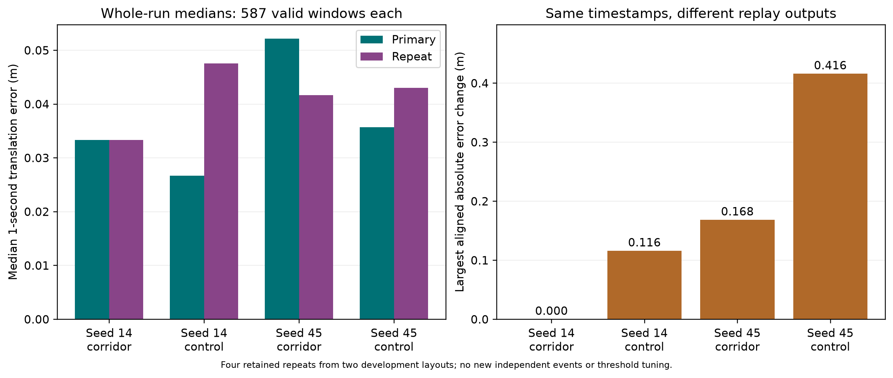
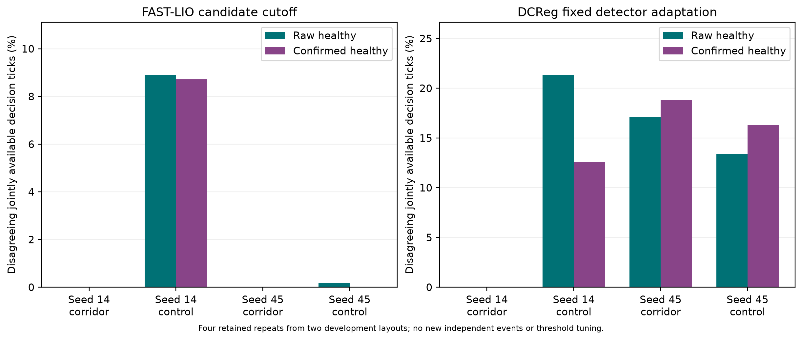

# T14 retained-repeat audit

Updated: 27 September 2026. Development evidence for R3 repair
T14-R3-01/T16-R3-07. Four repeat comparisons cover two geometry layouts;
they add no independent events. The primary outputs and the candidate
FAST-LIO cutoff remain unchanged.

## What was checked

The audit reverified every output hash in 64 primary run manifests and four
repeat manifests. It checked identical sensor/reference, backend and analysis
fingerprints; the documented seed-14 provenance-runner difference is excluded
from source parity. Seed 14 uses its earlier pre-batch smoke; seed 45 uses its
scheduled repeat. The failed scheduled seed-14 attempts stay in the ledger.
R3 must adjudicate that substitution. No held-out layout was accessed.

The [JSON audit](t14_repeatability_audit.json) records the input identities,
exact aligned comparisons, recovery labels, decisions, delays and interior
statistics. It uses the repaired T16 state machine and the candidate cutoff
`166.16366016039856` from the regenerated development analysis. DCReg remains
at its published detector threshold. Nothing was calibrated on repeats.

## Movement differences

These are whole-run descriptive one-second errors, with 587 jointly valid
rows in every comparison. All 597 estimator-start timestamps align exactly;
the ten unavailable endpoint rows are retained. There are no availability
disagreements. These summaries are not the frozen corridor-interior outcome.

| Scene | Primary median (m) | Repeat median (m) | Largest aligned absolute error change (m) |
| --- | ---: | ---: | ---: |
| Seed 14 corridor | 0.0333379179 | 0.0333379179 | 0 |
| Seed 14 control | 0.0267166003 | 0.0475476582 | 0.1159095239 |
| Seed 45 corridor | 0.0521550899 | 0.0416645768 | 0.1683963712 |
| Seed 45 control | 0.0356815529 | 0.0430280527 | 0.4159563392 |



## Warning-state differences

Every comparison has 596 jointly available decision ticks from the same
600-tick grid. The table shows disagreement counts over the full run; ticks
are correlated, so these are not independent event proportions.

| Scene | FAST-LIO raw / confirmed disagreements | DCReg raw / confirmed disagreements |
| --- | ---: | ---: |
| Seed 14 corridor | 0 / 0 | 0 / 0 |
| Seed 14 control | 53 / 52 | 127 / 75 |
| Seed 45 corridor | 0 / 0 | 102 / 112 |
| Seed 45 control | 1 / 0 | 80 / 97 |



Both repeated corridor events keep the same full recovery label, including
onset, confirmation and absence of relapse. Seed 14 recovers at onset
26.999722221 s; seed 45 at 25.999722221 s. Controls are assigned no recovery
label. Initial false-healthy and post-onset event-detection booleans agree
across each corridor repeat for both signals. This does not mean their
response timing is stable: seed-45 DCReg detection delay changes from
3.500277779 s to 1.300277779 s. Seed-14 delays match (FAST-LIO
5.200277779 s, DCReg 4.900277779 s). FAST-LIO misses seed-45 recovery in
both replays, so its delay is unavailable rather than zero.

## Interior-statistic sensitivity

As a descriptive audit, substitute each retained repeat pair into the
32-primary-layout calculation. These substitutions are not replacements of
the declared primary outputs, new samples or threshold-training inputs.

| Calculation | Paired sample SD (m) | Mean corridor minus control (m) | Final target pairs |
| --- | ---: | ---: | ---: |
| Original primary outputs | 0.2494728851 | 0.0850886115 | 48 |
| Substitute seed-14 repeat pair | 0.2494875999 | 0.0850422388 | 48 |
| Substitute seed-45 repeat pair | 0.2509281575 | 0.0824935481 | 48 |
| Substitute both repeat pairs | 0.2509422919 | 0.0824471754 | 48 |

The frozen minimum of 48 pairs is unchanged in all three sensitivity
calculations. That is limited evidence about the sample-size decision;
two repeated layouts cannot estimate general backend variability. The score,
warning-state and delay changes must remain part of the paper's limitations.
Backend repeatability by itself is not claimed as a novel contribution.

## Reproduction and figure exports

From the repository root, use the recorded Python 3.12.14 / NumPy 2.5.3
analysis environment:

```bash
python research_paper/experiments/src/audit_t14_repeatability.py \
  --analysis-manifest research_paper/evidence/t16_development_analysis_manifest.json \
  --output research_paper/experiments/generated/t14_repeatability_v1/audit.json
```

This verifies retained development streams and writes a separate reference
alias with the metadata's expected filename. The original analysis manifest
and no-data final plan are preserved under `evidence/archive/`.

Render the audit's saved numbers using the isolated figure environment:

```bash
python research_paper/experiments/src/plot_repeatability.py \
  --audit research_paper/evidence/t14_repeatability_audit.json \
  --output-dir research_paper/figures
```

Both figures are saved as PNG, PDF and SVG. The figure manifest records source,
script and export hashes plus rendering-library versions. Rendering does not
recompute scientific values. Five focused tests cover missing values,
nonfinite rejection, timestamp alignment and fixed-threshold decision changes.
This audit is ready for independent review; it does not itself pass R3.
